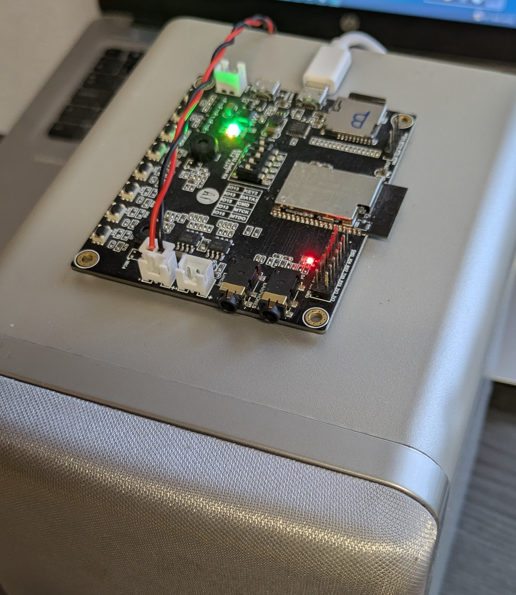

# Summary

The aim of this project is to develop an MP3 and TTS player that can be used for message and sound output in smart homes. The audio generated by text-to-speech is recorded and stored as an MP3 file on the SD card so that it can be played directly from there when called up again.

# Features:

- TTS (TextToSpeech): Google TTS free API (no registration needed)
- Playing MP3 audio are working offline, online connection needed for first tims use TTS and for long TTS Masseges
- MQTT for Triggering ESP actions
- FTP-Server use for one connection for upload of MP3-Files and setup of App.ini
- Queue for sequential playback of TTS and MP3 jobs and to avoid message overlap
- The text for the TTS output can be given a prefix (80!Water in the basement) that overrides the volume. This allows important messages to be played back loudly, regardless of the player's current settings, for example: Water in the basement!
- Each TTS player can subscribe to messages individually or as a group.

# Hardware

- ESP32-Audio-Kit ESP32-A1S 4 MB oder 8 MB for 15-17€ on Aliexpress.
- 

# SW Installation & Customizing

- Modify app.ini on the SD card
- Upload the project to VS Code
- Build firmware with PlatformIO and upload it to ESP32-A1S

# HW Installation #

- The power supply can be provided using a standard phone charger connected to the USB power port on the ESP32 board.
- For the speaker connection or for powering the board from a battery, you will need an XH-2.5 / 2.54 mm connector with a 20 cm cable.
- The board can be installed either inside a standard 100 × 100 mm electrical junction box from a hardware store or in a custom enclosure printed with a 3D printer.
- A quick way to test the board is by using the MyMQTT app on your smartphone.
- Warning! If you want to power the board with a battery, please note that the battery input requires 3.3 V. Make sure to read the documentation carefully before using the board in this configuration.
- You can connect passive speakers with 4 or 8 ohms to the board. These speakers can be purchased on eBay, or you can repurpose small speakers from an old stereo system or PC.

# Known issues

- Google TTS support short sentences only (Google limitation)
- The MQTT packet size is limited; messages and headers can be up to 256 bytes in size. If it to big then the ESP crashes and restarts
- The message queue was successfully tested using up to 10 KB of FreeHeep. There were about 60 messages.
- If the Internet connection is interrupted during a call to TTS services, the ESP crashes and restarts.
- The directory containing the cached MP3 files must not be too large, so please be careful. I have tested up to 1000 files.

## Jumper

- Jumper positions are: OFF,ON,ON,OFF,OFF

## SD-Card

- Format as FAT
- Copy the strucktur of direktory SD-Card to SD-Card and configuration App.ini file

## MQTT Command Topics:

| Topic            | Value | Responds                                      | Description               |
| :--------------- | :---- | --------------------------------------------- | ------------------------- |
| [host-name]/ping | .     | MP3 player responds with [host-name]/FreeHeap | Use this to get FreeHeap. |

## MP3/TTS Player Topics:

| Topic               | Topic example | value            | Description                              |
| :------------------ | ------------- | ---------------- | ---------------------------------------- |
| [host-name]/mp3     | gong-q/mp3    | /mp3/gong-a.mp3  | Only [host-name] player are playing     |
| [host-name]/tts     | gong-q/tts    | Hallo Mp3-Player |                                          |
| [host-name]/ttm     | gong-q/ttm    | Hallo Mp3-Player | The audio file is cached as an MP3 file. |
| [host-name]/stop    | gong-q/stop   | .                |                                          |
| [host-name]/volume  | gong-q/volume | 0.8              | max. Value 1                             |
| [host-name]/reboot  | gong-q/reboot | .                |                                          |
| [host-name]/speed   | gong-q/speed  | .                | Applies only to TTS and new TTM files    |
| [mqtt-house]/mp3    | gong/mp3      | /mp3/gong-a.mp3  | Play all players from the group [mqtt-house]   |
| [mqtt-house]/tts    | gong/tts      | Hallo            |                                          |
| [mqtt-house]/tts    | gong/tts      | 80!Hallo         | at 80% volume, Hallo                                         |
| [mqtt-house]/ttm    | gong/ttm      | Hallo            | The audio file is cached as an MP3 file. |
| [mqtt-house]/stop   | gong/stop     | .                |                                          |
| [mqtt-house]/volume | gong/volume   | 0.8              |                                          |

## Buttons:

| Button               |  Description                              |
| :------------------ |  ----------------------------------------  |
| Key3                | Stop play                                  |
| Key4                | Play the test sound                        |
| Key5                | Volume down                                |
| Key6                | Volume up                                  |

## Origin

The development is based on the work of Phil Schatzmann. I also used various libraries from different authors to realize my vision of an intelligent MP3/TTS player for smart home use.

[https://github.com/pschatzmann/arduino-audio-tools](https://)

